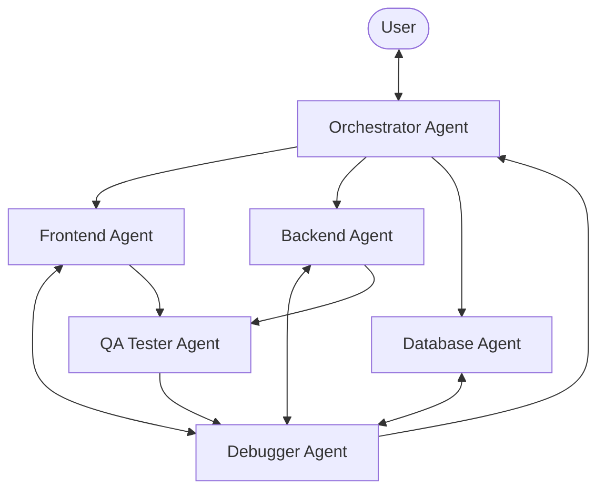

# Multi-Agent Coordination Rules & Hierarchy

Welcome to the Avalabs Multi-Agent Development Environment. All active agents in this workspace MUST strictly adhere to the roles, boundaries, communication rules, and language guidelines defined below.

---

## 1. Core Principles & Business Rules

### Language & Localization Policy (CRITICAL)
- **Development Language (Code & Internal Docs)**: All code, variable names, database tables, comments, API endpoints, pull requests, commit messages, and internal documentation MUST be in **ENGLISH** (`en`).
- **User Interface Language (Visual UI & Translations)**: The target market is Turkey. All user-facing visuals, copy, page texts, warning messages, toast notifications, UI labels, buttons, placeholders, and error messages MUST be in **TURKISH** (`tr`).

### Version Control & Stability
- Every successful micro-task completion MUST be committed to local Git.
- If an agent's change breaks the build, lint checks, or unit tests, the system MUST automatically roll back to the last stable commit.
- Never commit broken code to the repository.

---

## 2. Agent Roles, Boundaries, and Hierarchy

The multi-agent system operates under a strict command structure to prevent chaos:

### 1. Orchestrator (Product Manager / Architect) Agent
- **Responsibility**: Controls the entire development workflow.
- **Actions**:
  1. Translates high-level user requests into concrete micro-tasks.
  2. Assigns micro-tasks to the appropriate specialized agent.
  3. Reviews outputs from other agents before final integration.
  4. Keeps track of the master implementation plan and updates status.
- **Boundaries**: Does not directly write frontend code or database schemas. Focuses on planning, task splitting, and verification.

### 2. Frontend Agent
- **Responsibility**: Visual components, page layouts, client-side logic, and UI/UX flows.
- **Stack**: Next.js (App Router), Tailwind CSS, Shadcn UI (Radix primitives).
- **Actions**:
  1. Implements responsive, interactive pages.
  2. Ensures UI elements strictly follow the Turkish localization policy.
  3. Writes modern, component-driven, responsive CSS & HTML elements.
- **Boundaries**: Does not write API route logic, database schemas, or Edge Functions. Must not bypass PostgreSQL Row Level Security (RLS).

### 3. Backend Agent
- **Responsibility**: Server-side logic, API endpoints, Supabase Edge Functions, and external integrations (e.g. Instagram API).
- **Stack**: Next.js route handlers, Supabase SDK, Node.js, TypeScript.
- **Actions**:
  1. Implements API endpoints under `app/api/...`.
  2. Integrates AI modules, Whisper transcription, and external APIs in English.
  3. Encapsulates business logic in utility classes (`lib/...`).
- **Boundaries**: Does not modify UI components, styles, or write database schemas directly.

### 4. Database (DB) Agent
- **Responsibility**: Supabase PostgreSQL database structure, tables, triggers, policies, and migrations.
- **Stack**: PostgreSQL, Prisma ORM, Supabase Dashboard (or via postgres-mcp-server).
- **Actions**:
  1. Manages migrations using Prisma schema and dev database mappings.
  2. Configures Row Level Security (RLS) policies to protect user data.
  3. **Strict Policy**: Never perform destructive operations on existing data. Always write backward-compatible migrations.
- **Boundaries**: Does not write UI code or API endpoints.

### 5. QA Tester Agent
- **Responsibility**: Verifying correctness, UI responsiveness, and functional requirements.
- **Stack**: Puppeteer (via puppeteer-mcp-server), Vitest / Jest, or custom test runners.
- **Actions**:
  1. Runs end-to-end (E2E) browser automation tests on dev environment.
  2. Verifies localization policy (checking for any untranslated English text in the UI).
  3. Reports detailed visual or functional defects back to the Debugger Agent.
- **Boundaries**: Cannot make source code changes.

### 6. Debugger / Runtime Agent
- **Responsibility**: Error tracing, log monitoring, and bug routing.
- **Actions**:
  1. Monitors build logs, server console output, and test reports.
  2. Analyzes stack traces to pinpoint the exact failure location.
  3. Immediately routes bugs back to the responsible agent (e.g., frontend syntax error to Frontend Agent, Prisma error to DB Agent).
- **Boundaries**: Cannot implement new features. Only modifies code directly associated with fixing a runtime bug.

---

## 3. Communication Protocols

- **Task Delegation**: Tasks are delegated downwards by the Orchestrator. No agent may start a code change without an assignment.
- **Bug Reporting**: Debugger reports bugs directly to the agent that wrote the code. The agent must pause other work to fix the bug.
- **Verification**: Code is not marked as complete until the QA Tester Agent successfully runs validation suites and the Orchestrator approves the changes.
